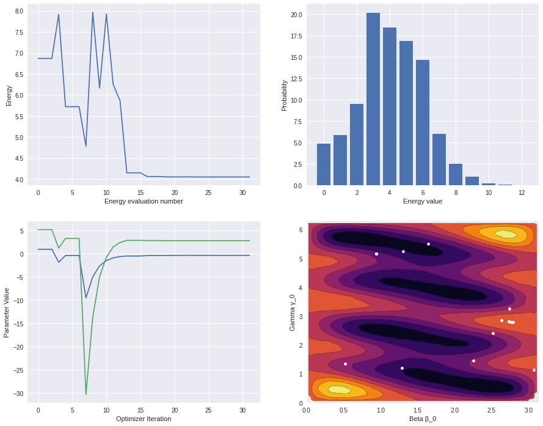
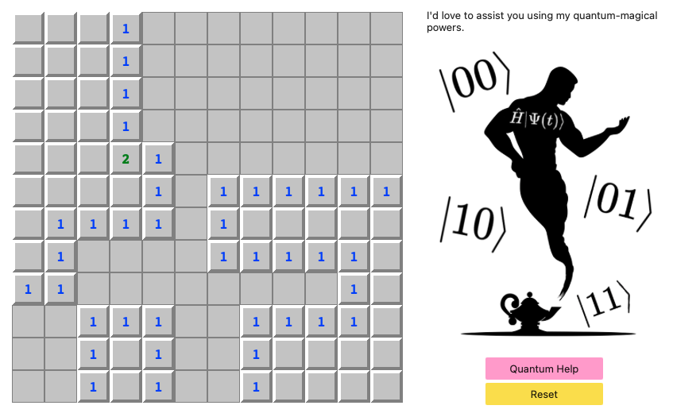

# Sweeping Mines with QAOA
***IonQ + Microsoft Joint Challenge @ MIT iQuHACK 2022!***   
Nicolas Camenisch, Amirabbas Kazeminia

– Using Quantum Computation and QAOA to solve Minesweeper

## Motivation
While minesweeper might look like a simple game, it is actually NP-complete. Thus finding a valid assignment can be computationally very expensive. This is why we tried to apply QAOA to this problem to find a valid solution to a board in polynomial time. Using various techniques like warm-starting we were able to produce a relatively robust solver that could theoretically, given enough quits, outperform classical solvers.

For more details on how our solver works, take a look at the QAOA.ipynb notebook. 

## How to run
We recommend to use qBraid's virtual environment to run the project. Alternatively, you can also run the Jupyter notebooks locally (qiskit required).

The central part of this project are the two Jupyter notebooks. The first (called QAOA.ipynb) illustrates how we used QAOA to find solutions for a minesweeper board and how we used warm-starting to significantly improve the rate of convergence. It also contains some nice visualizations of how the optimizer works.

The second notebook (minesweeper_game.ipynb) implements a basic minesweeper game. Whenever the player feels stuck, they can consult the 'quantum oracle' by pressing the help button. This passes the current board to our solver (depending on the difficulty of the board this step might take some time) and then displays the best (hopefully optimal) assignment of mines to the player.

## iQuHack - Personal Experience
Both of us really enjoyed this hackathon. It was a great opportunity to apply what we learned in 6.S089 to a real world problem. Sadly, we weren't able to run our solver on an actual quantum computer, due to the iterative nature of QAOA and the long queue wait times. Nevertheless, we could use the QPU to sample for possible solutions after having found good parameters using a local simulation.

We were also very pleased with qBraid's excellent online environment. It was very fast and responsive and significantly helped extend our laptop battery life.

## Screenshots

## Resources

* Egger et al. [Warm-starting quantum optimization](https://arxiv.org/pdf/2009.10095.pdf)
* [Qiskit tutorial Warm-starting quantum optimization](https://qiskit.org/documentation/optimization/tutorials/10_warm_start_qaoa.html)
* Terner and Hedbjörk. [Quantum Computational Speedup For The Minesweeper Problem](https://minesweepergame.com/math/quantum-computational-speedup-for-the-minesweeper-problem-2017.pdf)

  
  
  
  

